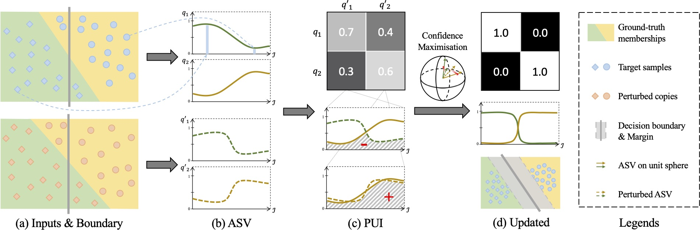
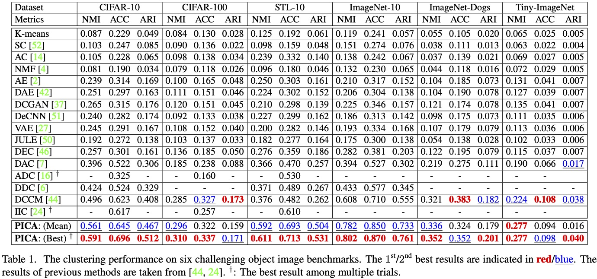

# PICA: PartItion Confidence mAximisation

*Accepted by IEEE Conference on Computer Vision and Pattern Recognition (CVPR 2020)*.

Pytorch implementation of [Deep Semantic Clustering by Partition Confidence Maximisation](https://raymond-sci.github.io/assets/project/huang2020pica/paper.pdf). 



## Highlight

+ We propose the idea of learning the most semantically plausible clustering solution by maximising partition confidence, which extends the classical maximal margin clustering idea to the deep learning paradigm. The proposed method makes no strong hypothesis on local inter-sample relations and/or cluster assignment which usually leads to error-propagation and inferior clustering solutions. 

+ We introduce a novel deep clustering method, called *PartItion Confidence mAximisation* (PICA). PICA is built upon a newly introduced partition uncertainty index that is designed elegantly to quantify the global confidence of the clustering solution. To enable formulating a deep learning objective loss function, a novel transformation of the partition uncertainty index is further proposed.

+ A stochastic approximation of the partition uncertainty index is introduced to decouple it from the whole set of target images, therefore, enabling a ready adoption of the standard mini-batch model training.

## Main results
The proposed PICA method was evaluated on a wide range of objects recognition benchmarks including CIFAR10/100, STL-10 and multiple variants of ImageNet. Results are shown as below:



## Implementation

### Requirements
Python 2.7 and Pytorch 1.0 are required. 
Please refer to [environment.yml](./environment.yml) for more details.  
A new environment with all the dependencies can be created by `conda env create -f environment.yml`. Target directory other than the default one can be specified by the flag `-p` to control where the environment lives.

### Usages

1. Clone this repo: `git clone https://github.com/Raymond-sci/PICA.git`
2. Download datasets: [CIFAR-100](https://www.cs.toronto.edu/~kriz/cifar.html) and [STL-10](http://ai.stanford.edu/~acoates/stl10/)
3. Examples of training PICA on different datasets are provided in `/config`. Use the command `python main.py --cfgs configs/base.yaml configs/cifar100.yaml` to run the experiments on CIFAR100. Most of the dataset-irrelevant arguments, *e.g.* optimiser and backbone, are specified in `configs/base.yaml`. Hence, replace `configs/cifar100.yaml` by `configs/stl10.yaml` to run on STL-10. 
4. Use the flag `--data-root` in command line or modify the config files to set the data path
5. The program is run on CPU by default, use the flag `--gpus 0,1,...` to specify the gpu devices that you want to use

Every time the `main.py` is run, a new session will be started with the name of current timestamp and all the generated files will be stored in folder `sessions/timestamp/` including checkpoints, logs, etc. Use the flag `--session` to specify a session name and `--debug` to produce no file.

### Customisation

There are lots of arguments can be used to customise a session and most of them are declared by the corresponding module (*e.g.* those related to network structure are declared by either `/lib/networks/__init__.py` or `/pica/networks.py`) instead of stacking up at the beginning of the main file. 
Therefore, check a bit the module you are interested in to see what arguments are provided.

**Run on other datasets.** 
Basically, to plug in a new dataset, all you need to do is implementing the object class and register it by `lib.datasets.register("dataset_id", dataset_class)`. 
Afterwards, you can train on it by `python main.py --dataset "dataset_id"`. Please refer to the implementation of STL-10 in `/pica/datasets.py`. You may also need to specify the data splits of each dataset in `main.py` (hard-coded).

**Run with other architectures.**
Similarly, to run with your own backbone architecture, implement it and register by `lib.networks.register("network_id", network_class`), which will allow you to use it by the flag `--network "network_id"`. Check `/pica/networks.py` for example.

### Pre-trained model
Trained models on all the datasets are provided [here](https://drive.google.com/open?id=1o5xE75YFnQ9O7kk79ShsUJ3koZcQ71NM) for playing around, 
but note that not all of them are the best results reported in the paper.

## License
This project is licensed under the MIT License. You may find out more [here](./LICENSE).

## Citation
Please cite our paper if you find this repo useful:

Jiabo Huang, Shaogang Gong and Xiatian Zhu. "Deep Semantic Clustering by Partition Confidence Maximisation." Proc. CVPR (2020).

```
@InProceedings{huang2020pica,
  title={Deep Semantic Clustering by Partition Confidence Maximisation},
  author={Jiabo Huang, Shaogang Gong and Xiatian Zhu},
  booktitle={Proceedings of IEEE Conference on Computer Vision and Pattern Recognition (CVPR)},
  year={2020},
}
```